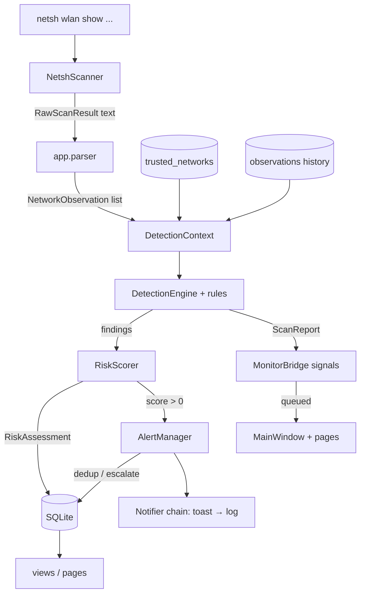

# Rogue AP Hunter — Architecture

Components, data flow, threading model, storage schema, configuration model and
exit codes. Everything below reflects the code as it exists in this
repository (`app/`), not a target design.

---

## 1. Components

| Component | Module(s) | Role |
|-----------|-----------|------|
| Entry point / CLI | `app/main.py`, `app/__main__.py` | Argument parsing, logging bootstrap, configuration load, exit codes. Exposed as `rogue-ap-hunter` (console script) and `python -m app`. |
| Application context | `app/core/context.py` | `AppContext` builds and owns the whole object graph (database, repositories, engine, scorer, alert manager, scanner, pipeline, monitoring service) and applies configuration changes at runtime. |
| Paths | `app/core/paths.py` | Derives every location from `ROGUE_AP_HUNTER_HOME` / platform defaults; creates directories on demand. |
| Configuration | `app/core/config.py` | Frozen `Config` + `RiskWeights` dataclasses, validation, atomic JSON save/load. |
| Logging | `app/core/logging_setup.py` | Idempotent bootstrap: console handler + rotating file handler (1 MB, 3 backups). |
| Scanner | `app/scanner/netsh.py`, `raw.py`, `errors.py` | Read-only adapter for `netsh wlan show networks mode=bssid` and `netsh wlan show interfaces`; fixed argument lists, timeouts, typed errors. Returns `RawScanResult` (text only). |
| Parser | `app/parser/netsh_networks.py`, `interfaces.py` | Defensive text parsing into `NetworkObservation` and `InterfaceInfo`. |
| Domain models | `app/models/` | Validated, mostly frozen dataclasses: `NetworkObservation`, `TrustedNetwork`, `Alert`, `Severity`, `ScanSession`, `ApplicationSetting`, BSSID/security helpers. Import nothing outside the stdlib. |
| Detection | `app/detection/` | `DetectionContext` (input snapshot), five pure rules in `rules.py`, `DetectionEngine` (persistence tracking, `DetectionReport`). |
| Scoring | `app/scoring/risk.py` | `RiskScorer` → `RiskAssessment` (score, severity, reasons, per-rule breakdown). |
| Storage | `app/storage/` | `Database` (thread-safe SQLite handle), versioned schema, parameterised repositories. |
| Alerts | `app/alerts/manager.py`, `notifiers.py` | `AlertManager` (create/dedup/escalate/acknowledge/resolve/notify), `Notifier` chain: Windows toast → log. |
| Services | `app/services/` | `ScanPipeline` (one synchronous pass), `MonitoringService` (background loop), `views.py` (live-network snapshots), `export.py` (atomic CSV). |
| Frame observer | `app/capture/` | Optional passive beacon analysis: `beacons.py` (pure radiotap/802.11 parser), `source.py` (ctypes binding to the system `wpcap.dll`, BPF management-frame filter), `observer.py` (session index + evidence lines). Degrades to "unavailable" without the Npcap driver. |
| UI | `app/ui/` | `shell.MainWindow` (sidebar, routing, monitoring controls), `bridge.MonitorBridge` (thread → GUI signals), `pages/` (Dashboard, Live networks, Investigation, Alerts, Trusted networks, History, Settings, About), `theme.py`, `widgets.py`, `table_models.py`. |

---

## 2. Data flow

### 2.1 One scan (happy path)

```
        Windows                          Rogue AP Hunter
 ┌───────────────────┐
 │ netsh wlan show    │   raw text      ┌──────────────────────────────────────────┐
 │ networks mode=bssid├────────────────►│ NetshScanner.scan()  → RawScanResult      │
 └───────────────────┘                  └───────────────┬──────────────────────────┘
 ┌───────────────────┐                                  │ text
 │ netsh wlan show    ├────────────────► parse_visible_networks_as_observations()
 │ interfaces         │                  parse_interfaces()   (connection state)
 └───────────────────┘                                  │
                                                        ▼
                                      ┌──────────────────────────────────────────┐
                                      │ DetectionContext                         │
                                      │  observations + trusted profiles +       │
                                      │  known BSSIDs + connected BSSID/signal + │
                                      │  history_available                       │
                                      └───────────────┬──────────────────────────┘
                                                      ▼
                                      DetectionEngine.evaluate()
                                        ├─ all_rules(): duplicate_ssid, unknown_bssid,
                                        │  security_downgrade, new_access_point,
                                        │  suspicious_signal
                                        └─ persistence tracking → +persistence finding
                                                      │ findings grouped by (ssid, bssid)
                                                      ▼
                                      RiskScorer.assess_grouped()
                                        score = Σ max weight per distinct rule, clamp 0–100
                                        severity from thresholds (30/60/80)
                                                      │ RiskAssessment[]
                                                      ▼
                                      persist: observations (add_many), risk_scores
                                                      │ score > 0
                                                      ▼
                                      Alert.from_score() → AlertManager.record()
                                        ├─ no open match  → INSERT (created → notify)
                                        └─ open match     → occurrence++ (escalation → notify)
                                                      │
                                                      ▼
                                      ScanReport {session, observations, findings,
                                                  assessments, alerts, duration, error}
                                                      │ callbacks (worker thread)
                                                      ▼
                                      MonitorBridge.emit_report() → Qt Signal
                                                      │ queued connection
                                                      ▼
                                      MainWindow._on_report() on the GUI thread
                                        → status bar, alert indicator, page refresh
```

### 2.2 Mermaid version



### 2.3 Failure paths

- Scanner unavailable / timeout / non-zero exit → `ScanPipeline` catches
  `ScannerError`, marks the session `failed`, and returns a `ScanReport` with
  `error` set. **No exception reaches the UI.**
- Storage unusable when a pass starts (locked, read-only, deleted mid-run) →
  `self._sessions.start()` raises; there is no session row to update, so
  `run()` logs the exception and returns an in-memory report whose session is
  `ScanSession().finish(FAILED)` with
  `error = "… local storage is unavailable"`.
- A failure *after* the session was created (`_fail()`) tries to persist
  `status=failed`; if that write also fails it falls back to finishing the
  session object in memory, so the report still tells the truth.
- Unexpected pipeline exceptions are caught, logged with traceback, and
  converted to an error report.
- Monitoring callbacks that raise are logged and ignored — they cannot kill
  the loop.
- Notifier failures return `False` and fall through to `LogNotifier`; the
  in-app alert list is written regardless.

---

## 3. Threading model

```
                 worker thread "rogue-ap-monitor"          GUI thread (Qt event loop)
                 ────────────────────────────────          ─────────────────────────
MonitoringService._loop()
   │  scan immediately on start
   │  ScanPipeline.run()  ──► netsh (subprocess, 20 s cap)
   │  on_report(report) ──────────────► MonitorBridge.emit_report()
   │  on_error(message) ──────────────► MonitorBridge.emit_error()
   │  stop_event.wait(interval)                 │ Qt signal emission from a
   └─ repeat until stop()                        │ non-GUI thread is queued
                                                ▼
                                     MainWindow._on_report / _on_error
                                        status bar · alert indicator
                                        current page on_scan_report()/refresh()
```

- **One worker thread**, daemon-flagged so it never blocks process exit.
  `start()` is idempotent (a second start is refused with a warning);
  `stop(timeout=10)` signals a `threading.Event` and joins the thread.
- **Scans never overlap**: a `threading.Lock` is acquired non-blocking around
  each pass, and `start`/`stop` are serialised by a separate lifecycle lock.
- **Callbacks run on the worker thread** by contract
  (`MonitoringService` docstring). The UI never assumes otherwise: it passes
  `MonitorBridge` methods as callbacks, and Qt's queued connection semantics
  deliver the signals to slots on the GUI thread.
- **`Scan once` is asynchronous**: the button submits
  `MonitoringService.scan_once_async()`, which spawns a daemon thread
  (`rogue-ap-oneshot`) and returns immediately. The button is disabled until
  the report arrives through `MonitorBridge._on_report` (which re-enables it
  for every report, loop or one-shot). Submissions are refused while a scan
  is in flight — the service checks both its own one-shot slot and the
  `_scan_lock` the loop holds while scanning — so the status bar reports
  "A scan is already in progress" instead of queueing a duplicate pass.
  Both paths serialise on `_scan_lock`: scans never overlap.
- **Database access** from both threads is safe by construction: a single
  SQLite connection guarded by an `RLock`, `check_same_thread=False`, WAL
  mode, `busy_timeout = 5000`.
- **Bridge signals:** `report_ready(object)`, `error_raised(str)`,
  `monitoring_changed(bool)`, `alert_count_changed(int)` (emitted from
  `emit_report` for successful reports).
- **Frame observer thread** (`rogue-ap-frames`, optional): a second daemon
  thread exists only while frame capture is enabled *and* the Npcap driver
  is present (see §7). It calls `pcap_next_ex` with a 500 ms read timeout,
  so `stop()` returns within roughly a second even on an idle network. The
  thread never touches SQLite; it only fills an in-memory BSSID index that
  the pipeline reads (with a lock) when an alert is written.

---

## 4. Storage schema summary

SQLite file: `<home>/data/rogue_ap_hunter.sqlite3` · schema version **1**
(`app/storage/schema.py`), migrations applied transactionally.

| Table | Purpose | Key columns |
|-------|---------|-------------|
| `schema_meta` | Schema version stamp | `key`, `value` |
| `scan_sessions` | One row per scan pass | `started_at`, `completed_at`, `network_count`, `status` (`running`/`completed`/`failed`) |
| `observations` | Every radio sighting | `ssid`, `bssid`, `signal_strength`, `security`, `channel`, `observed_at`, `scan_session_id → scan_sessions` |
| `trusted_networks` | Approved baseline | `ssid` (UNIQUE), `approved_bssids` (JSON array), `expected_security`, `created_at`, `notes` |
| `alerts` | Explainable events + workflow | `ssid`, `bssid`, `alert_type`, `risk_score`, `severity`, `reasons` (JSON), `status`, `first_seen`, `last_seen`, `occurrence_count` |
| `risk_scores` | Score history for Investigation | `ssid`, `bssid`, `score`, `severity`, `reasons`, `created_at` |
| `application_settings` | Generic key/value settings | `key` (PK), `value`, `updated_at` |

Indexes: `observations(observed_at)`, `observations(bssid)`,
`observations(ssid)`, `alerts(created_at)`, `alerts(status)`,
`alerts(severity)`, `alerts(ssid, bssid, status)`,
`risk_scores(ssid, bssid, created_at)`.

Connection flags: `foreign_keys = ON`, `journal_mode = WAL`,
`busy_timeout = 5000`, connect `timeout = 10.0`, `row_factory = sqlite3.Row`.
All statements use bound parameters.

**Retention:** every 20 scans (`DEFAULT_PRUNE_EVERY_SCANS`), rows older than
`data_retention_days` (default 90) are deleted from `observations` and
`risk_scores`, and from `alerts` only when `status != 'active'`.

---

## 5. Configuration model

- **Type:** frozen `Config` dataclass with nested frozen `RiskWeights`
  (`app/core/config.py`). Every mutation goes through `validate()` (or
  `with_overrides()`), which enforces:
  - `5 ≤ scan_interval_seconds ≤ 3600`
  - `0 < suspicious_threshold < high_threshold < critical_threshold ≤ 100`
  - `1 ≤ data_retention_days ≤ 3650`
  - `notifications_enabled` is a bool; `log_level` ∈
    `DEBUG, INFO, WARNING, ERROR, CRITICAL`
  - every risk weight an integer in `0..100`
- **Storage:** JSON at `<home>/config.json` (or `--config PATH`), written
  atomically (`.tmp` + `Path.replace`). Unknown keys are ignored with a
  warning so downgrades keep working; a corrupt/unreadable file never crashes
  startup — defaults are used and the failure is logged.
- **Defaults:**

  | Key | Default |
  |-----|---------|
  | `scan_interval_seconds` | 15 |
  | `suspicious_threshold` / `high_threshold` / `critical_threshold` | 30 / 60 / 80 |
  | `notifications_enabled` | `true` |
  | `data_retention_days` | 90 |
  | `log_level` | `INFO` |
  | `risk_weights.duplicate_ssid` | 25 |
  | `risk_weights.unknown_bssid` | 20 |
  | `risk_weights.security_downgrade` | 30 |
  | `risk_weights.new_access_point` | 10 |
  | `risk_weights.suspicious_signal` | 5 |
  | `risk_weights.persistence` | 10 |

- **Application at runtime** (`AppContext.save_config()` → `apply_config()`,
  mirrored by `tests/integration/test_config_application.py`):
  1. The new `Config` is validated and written to disk atomically.
  2. `AlertManager.apply_config(config)` adopts it **in place** — rebuilding
     the manager would discard the per-identity notification cooldown state and
     the configured notify interval.
  3. `ScanPipeline.apply_config(config, alert_manager=…)` re-points the
     pipeline: weights, thresholds and the retention window take effect on the
     **next** scan, and `DetectionEngine.with_config()` keeps the learned
     persistence counters (a settings change never erases what monitoring has
     observed). The scorer is rebuilt from the new weights.
  4. If `scan_interval_seconds` changed, a new `MonitoringService` is created
     with the new interval and the existing `on_report`/`on_error` callbacks;
     it is restarted only if the loop was running when the change was saved.
  Note `notifications_enabled` is stored and validated but does not rebuild
  the notifier chain (the chain is built once at launch) — see
  [`user-manual.md`](user-manual.md) §3.7.
- **Process-level settings:** the log level of a run comes from
  `--log-level` (default `INFO`), not from the file.
- **Environment:** `ROGUE_AP_HUNTER_HOME` relocates the entire data home;
  `QT_QPA_PLATFORM=offscreen` is used by GUI tests.

---

## 6. Exit codes

Defined in `app/main.py`:

| Code | Constant | Meaning |
|-----:|----------|---------|
| `0` | `EXIT_OK` | Success — including `--headless` initialisation and `--write-default-config`. |
| `1` | `EXIT_FAILURE` | Unexpected runtime failure: configuration could not be written, storage could not be opened, directories could not be prepared, or an unhandled error escaped the GUI run. |
| `2` | `EXIT_USAGE` | Invalid command-line arguments (argparse default: unknown flag, bad `--log-level` value). |
| `3` | `EXIT_GUI_UNAVAILABLE` | The graphical interface could not be started — `app.ui.shell` failed to import (typically PySide6 missing). The log explains how to fix it; `--headless` still works. |

A Qt event-loop exit code is propagated as-is when the window closes normally
(`run_app` returns `application.exec()`'s value, `0` for a normal close).

---

## 7. Passive frame observer (optional)

`app/capture/` is an additive evidence layer below netsh. It is the only
part of the application that touches a capture driver, and it is built to
be absent: without the free Npcap driver every code path degrades to a
recorded status message while scanning continues exactly as before.

```
 Npcap driver (system, not bundled)
        │ wpcap.dll via ctypes — no third-party Python packages
        ▼
 FrameSource  ── pcap_findalldevs → registry GUID → "Wi-Fi" friendly name
        │       pcap_open_live (snaplen 65535, 500 ms timeout)
        │       BPF "type mgt subtype beacon-probe-resp" (best effort)
        │       thread "rogue-ap-frames": pcap_next_ex loop
        ▼ raw link-layer bytes
 parse_frame()  ── pure parser: radiotap/PPI skip → mgmt header → IEs
        │           SSID / DS channel / RSN(AKM, MFPC/MFPR) / WPA1 / WPS
        ▼ BeaconInfo (bssid, hidden, wps, pmf, sae, wep_era, ...)
 FrameObserver  ── in-memory dict[bssid] → FrameRecord (first/last, count)
        │           evidence lines, max 4 per alert
        ▼
 ScanPipeline._enriched_reasons()  ── appended AFTER scoring
```

Design guarantees:

1. **Passive only.** The source calls no `pcap_sendpacket`-style function;
   the parser interprets only the two management subtypes an AP broadcasts
   in the clear. Data frames, client addresses and encrypted payloads are
   never read into the index.
2. **Score integrity.** Evidence lines are appended to `reasons` after the
   score is computed; risk weights remain the only score input
   (regression-tested in `tests/integration/test_monitoring.py`).
3. **No new dependencies, no licence contagion.** The driver is referenced
   from the operating system; nothing is vendored, pip-installed or
   bundled, so the MIT licence and the offline-first build are unchanged.
4. **Graceful degradation.** `check_availability()` distinguishes
   *unavailable* (driver missing, non-Windows) from *error* (driver present
   but the adapter refused capture). Both appear in Settings →
   “Passive frame observer” status; neither raises into the UI.
5. **Configurable.** `frame_observer_enabled` (default `true`) is toggled
   live through Settings; `AppContext.apply_config()` starts or stops the
   capture thread without restarting the application.
